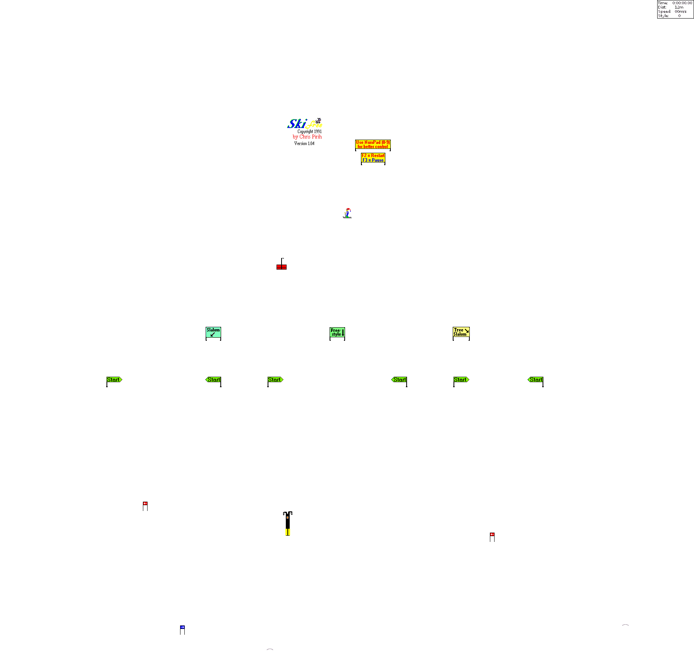

# *SkiFree* in Docker

## What is it?

The classic 90s game [**SkiFree**](https://en.wikipedia.org/wiki/SkiFree) running in [WINE](https://www.winehq.org) via X from your host Linux system.


## How to Run

You need to pass your `$DISPLAY` env var, match your user ID and patch through the X socket, like this:

```bash
docker run -it --rm -e DISPLAY=$DISPLAY --user `id -u` -v="/tmp/.X11-unix:/tmp/.X11-unix" skifree-wine
```

## Which version of the game is this?

It runs [the _most officialest_ 32bit build](http://ski.ihoc.net/) from the original website.

## But... why?!

_I was so preoccupied with whether I could, that I didn't stop to think if I should..._

Kidding aside, unlike the original from Windows 3.1 (that you can still run [in DOSBOX online](https://classicreload.com/win3x-skifree.html)), this one scales to the biggest your screen can fit.

Here it is running in my laptop's high-DPI display at glorious 1792x1696 resolution:



and in action:


## Can I escape the Yeti?!

[Yes](https://youtube.com/watch?v=qf3p0WGS5mc), it's possible.


**Escape** the Yeti by **traveling another 2000 m from the point at which the monster gives chase**, creating a loop and starting over from the beginning.

One way to evade it is to go directly left or right in _fast mode_ with the "F" key. He is right behind you, but cannot catch you unless you hit an obstacle.

## I'm on Windows, how do I run this?

You're on Windows?? Dude, you don't need WINE.. You don't even need Docker!

Just run the actual [executable](http://ski.ihoc.net/ski32.exe).

## But really, why did you make this?

I was reading about X forwarding in Docker containers and wanted to put it to practice.

This exercise taught me that `--user` in `docker run` with your own user ID lets you tap into your active X session easily without file ownership issues or X security errors.

---

Enjoy! (and don't let the Yeti get ya!!)
